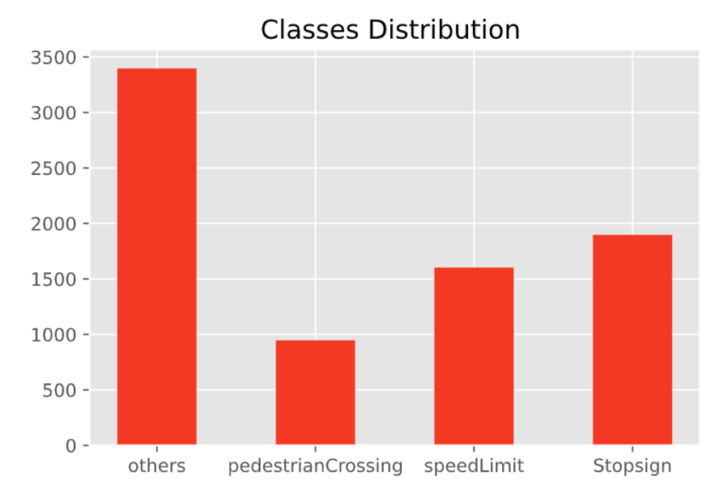
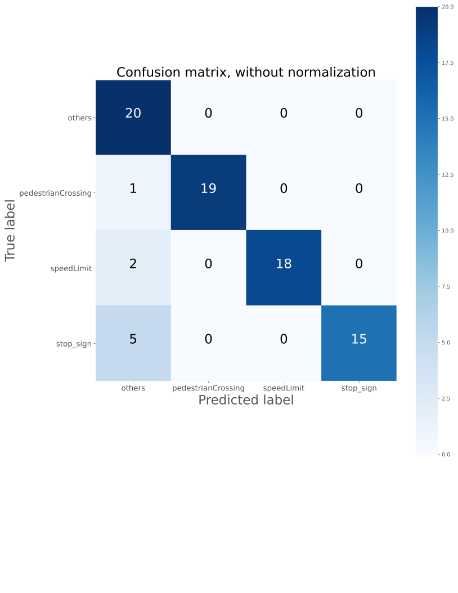

## Traffic Sign Classification

Background and scope of work:

    Traffic signs provide critical information drivers, which in turn requires them to adjust their driving behavior to make sure they follow with whatever road regulation currently enforced. Autonomous vehicles must also recognize and understand traffic signs to follow abide by road legislation.
    I will build a convolutional neural network to classify traffic signs

DataSet 

    The dataset that will be used in this project is traffic sign dataset downloaded from from Laboratory for Intelligent & Safe Automobiles (LISA)
    7840 rgb images-divided into 4 classes
    Sign sizes from 6x6 to 168x168 pixels.

  

  

Dataset pipeline:

    Rescale images to 32 x 32 x 1 (grayscale) 
    Split dataset into 80/20 train-validatation
    Batch size = 32

  

Build simple 3 layers CNN:

  

  

The test accuracy is about 55%

  

Using Transfer Learning:

    -Import base Xception model from Keras without last layer
    -Adding the last layer:
        +Adding GlobalAveragePooling2D
        +Adding activation 'relu'
        +Adding dropout rate .5
        +change number of classes to 4
    -Retrain dataset with different image size (299,299,3) and in rgb , with 5 epochs

    

  

    

  

